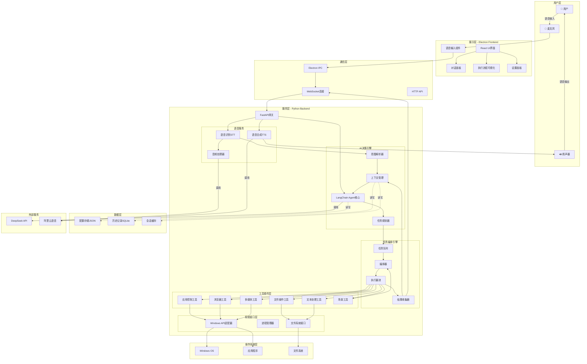
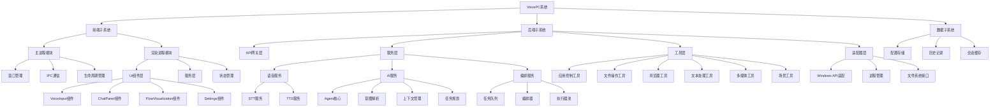
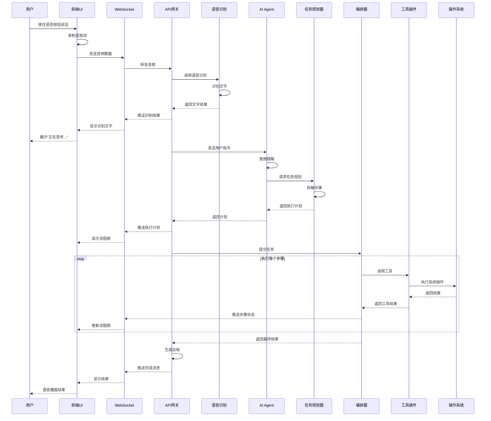
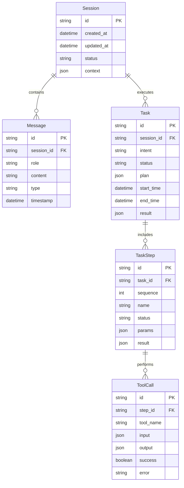
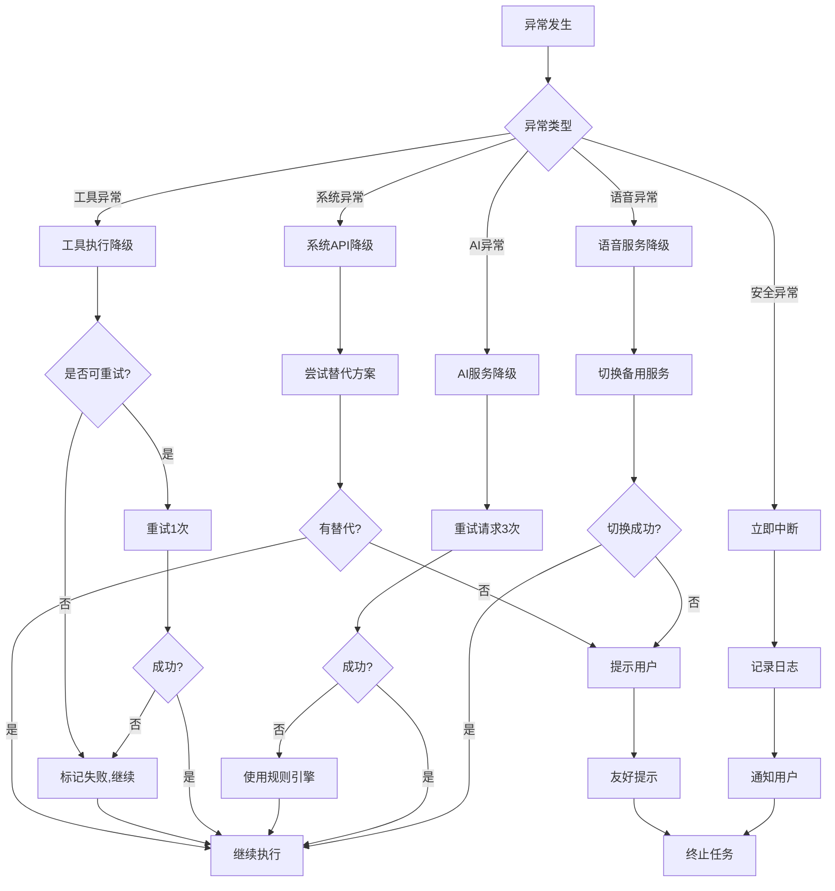
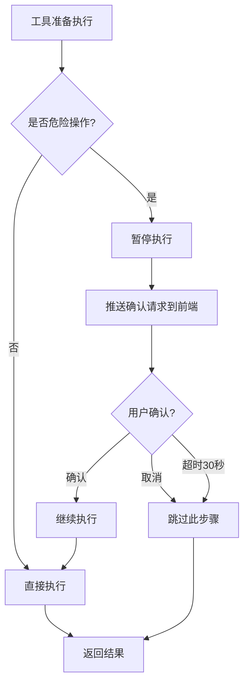

# 架构设计文档 - VoicePC AI语音控制助手

## 📐 1. 整体架构设计

### 1.1 系统架构全景图



---

## 🏗️ 2. 分层架构设计

### 2.1 六层架构模型

```
┌─────────────────────────────────────────────────────────┐
│  L1: 展示层 (Presentation Layer)                         │
│  职责: 用户交互、界面渲染、状态展示                        │
│  技术: Electron + React + TypeScript                     │
└─────────────────────────────────────────────────────────┘
                          ↕
┌─────────────────────────────────────────────────────────┐
│  L2: 通信层 (Communication Layer)                        │
│  职责: 前后端通信、消息序列化、实时推送                    │
│  技术: WebSocket + HTTP + IPC                           │
└─────────────────────────────────────────────────────────┘
                          ↕
┌─────────────────────────────────────────────────────────┐
│  L3: 服务层 (Service Layer)                              │
│  职责: 业务逻辑、语音处理、AI决策                         │
│  技术: FastAPI + LangChain + 异步处理                    │
└─────────────────────────────────────────────────────────┘
                          ↕
┌─────────────────────────────────────────────────────────┐
│  L4: 编排层 (Orchestration Layer)                        │
│  职责: 任务调度、流程编排、结果聚合                        │
│  技术: 任务队列 + 状态机                                  │
└─────────────────────────────────────────────────────────┘
                          ↕
┌─────────────────────────────────────────────────────────┐
│  L5: 工具层 (Tool Layer)                                 │
│  职责: 具体能力实现、工具插件                             │
│  技术: Python插件系统                                     │
└─────────────────────────────────────────────────────────┘
                          ↕
┌─────────────────────────────────────────────────────────┐
│  L6: 系统层 (System Layer)                               │
│  职责: 操作系统交互、底层API调用                          │
│  技术: pyautogui + pywinauto + win32api                 │
└─────────────────────────────────────────────────────────┘
```

---

## 📦 3. 核心模块设计

### 3.1 前端模块 (Electron + React)

#### 模块结构
```
frontend/
├── src/
│   ├── main/                    # Electron主进程
│   │   ├── main.ts              # 主进程入口
│   │   ├── ipc/                 # IPC通信处理
│   │   │   ├── voiceHandler.ts  # 语音相关IPC
│   │   │   ├── chatHandler.ts   # 对话相关IPC
│   │   │   └── systemHandler.ts # 系统相关IPC
│   │   └── window/              # 窗口管理
│   │       └── mainWindow.ts    # 主窗口配置
│   │
│   ├── renderer/                # React渲染进程
│   │   ├── App.tsx              # 根组件
│   │   ├── components/          # UI组件
│   │   │   ├── VoiceInput/      # 语音输入组件
│   │   │   │   ├── VoiceButton.tsx
│   │   │   │   ├── WaveForm.tsx
│   │   │   │   └── StatusIndicator.tsx
│   │   │   ├── ChatPanel/       # 对话面板
│   │   │   │   ├── ChatPanel.tsx
│   │   │   │   ├── MessageList.tsx
│   │   │   │   └── MessageItem.tsx
│   │   │   ├── FlowVisualization/ # 流程可视化
│   │   │   │   ├── FlowCanvas.tsx
│   │   │   │   ├── TaskNode.tsx
│   │   │   │   └── FlowControls.tsx
│   │   │   └── Settings/        # 设置面板
│   │   │       ├── SettingsPanel.tsx
│   │   │       ├── APIConfig.tsx
│   │   │       └── VoiceConfig.tsx
│   │   ├── services/            # 前端服务
│   │   │   ├── websocket.ts     # WebSocket客户端
│   │   │   ├── api.ts           # HTTP API客户端
│   │   │   └── storage.ts       # 本地存储
│   │   ├── store/               # 状态管理
│   │   │   ├── useAppStore.ts   # 应用状态
│   │   │   ├── useChatStore.ts  # 对话状态
│   │   │   └── useFlowStore.ts  # 流程状态
│   │   └── types/               # TypeScript类型定义
│   │       └── index.ts
│   └── preload/                 # 预加载脚本
│       └── preload.ts
└── package.json
```

#### 核心组件职责

**VoiceInput组件**
- 麦克风权限获取
- 实时音频流采集
- 波形可视化展示
- 录音状态管理

**ChatPanel组件**
- 对话历史展示
- 消息类型渲染（用户/AI/系统）
- 自动滚动
- 上下文提示

**FlowVisualization组件**
- 任务执行流程图
- 实时状态更新（pending/running/success/failed）
- 节点交互（查看详情）
- 执行进度展示

---

### 3.2 后端模块 (Python FastAPI)

#### 模块结构
```
backend/
├── app/
│   ├── main.py                  # FastAPI应用入口
│   ├── config.py                # 配置管理
│   ├── api/                     # API路由
│   │   ├── __init__.py
│   │   ├── voice.py             # 语音相关API
│   │   ├── chat.py              # 对话API
│   │   ├── task.py              # 任务执行API
│   │   └── system.py            # 系统信息API
│   │
│   ├── services/                # 业务服务层
│   │   ├── voice/               # 语音服务
│   │   │   ├── __init__.py
│   │   │   ├── stt_service.py   # 语音识别服务
│   │   │   ├── tts_service.py   # 语音合成服务
│   │   │   └── audio_processor.py # 音频处理
│   │   │
│   │   ├── ai/                  # AI服务
│   │   │   ├── __init__.py
│   │   │   ├── agent_service.py # Agent核心服务
│   │   │   ├── intent_parser.py # 意图解析
│   │   │   ├── context_manager.py # 上下文管理
│   │   │   └── task_planner.py  # 任务规划
│   │   │
│   │   └── orchestration/       # 编排服务
│   │       ├── __init__.py
│   │       ├── task_queue.py    # 任务队列
│   │       ├── orchestrator.py  # 编排器
│   │       ├── executor.py      # 执行器
│   │       └── result_collector.py # 结果收集
│   │
│   ├── tools/                   # 工具插件
│   │   ├── __init__.py
│   │   ├── base_tool.py         # 工具基类
│   │   ├── app_control.py       # 应用控制工具
│   │   ├── file_operation.py    # 文件操作工具
│   │   ├── browser_control.py   # 浏览器控制工具
│   │   ├── text_processing.py   # 文本处理工具
│   │   ├── media_control.py     # 多媒体控制工具
│   │   └── scene_manager.py     # 场景管理工具
│   │
│   ├── adapters/                # 系统适配器
│   │   ├── __init__.py
│   │   ├── windows_api.py       # Windows API封装
│   │   ├── process_manager.py   # 进程管理
│   │   └── file_system.py       # 文件系统接口
│   │
│   ├── models/                  # 数据模型
│   │   ├── __init__.py
│   │   ├── message.py           # 消息模型
│   │   ├── task.py              # 任务模型
│   │   └── session.py           # 会话模型
│   │
│   ├── database/                # 数据库
│   │   ├── __init__.py
│   │   ├── sqlite_db.py         # SQLite连接
│   │   └── repositories/        # 数据访问层
│   │       ├── message_repo.py
│   │       └── session_repo.py
│   │
│   └── utils/                   # 工具函数
│       ├── __init__.py
│       ├── logger.py            # 日志工具
│       ├── security.py          # 安全工具
│       └── validators.py        # 验证工具
│
├── tests/                       # 测试
├── requirements.txt             # Python依赖
└── .env.example                 # 环境变量模板
```

---

## 🔗 4. 模块层次结构图



---

## 🔌 5. 接口契约定义

### 5.1 前后端通信接口

#### WebSocket接口

**连接端点**: `ws://localhost:8000/ws`

**消息格式**:
```typescript
interface WSMessage {
  type: 'voice' | 'chat' | 'task' | 'system';
  action: string;
  data: any;
  timestamp: number;
  messageId: string;
}
```

**消息类型**:

1. **语音消息 (voice)**
```typescript
// 客户端 → 服务端: 语音数据流
{
  type: 'voice',
  action: 'stream',
  data: {
    audioChunk: string; // base64编码的音频
    sampleRate: number;
    encoding: 'pcm' | 'wav';
  }
}

// 服务端 → 客户端: 识别结果
{
  type: 'voice',
  action: 'recognized',
  data: {
    text: string;
    confidence: number;
  }
}
```

2. **对话消息 (chat)**
```typescript
// 客户端 → 服务端: 用户输入
{
  type: 'chat',
  action: 'send',
  data: {
    text: string;
    mode: 'voice' | 'text';
  }
}

// 服务端 → 客户端: AI响应
{
  type: 'chat',
  action: 'response',
  data: {
    text: string;
    intent: string;
    confidence: number;
  }
}
```

3. **任务消息 (task)**
```typescript
// 服务端 → 客户端: 任务状态更新
{
  type: 'task',
  action: 'status',
  data: {
    taskId: string;
    status: 'pending' | 'running' | 'success' | 'failed';
    progress: number;
    currentStep: string;
    result?: any;
    error?: string;
  }
}

// 服务端 → 客户端: 执行流程
{
  type: 'task',
  action: 'flow',
  data: {
    steps: Array<{
      id: string;
      name: string;
      status: string;
      startTime?: number;
      endTime?: number;
    }>;
  }
}
```

#### HTTP REST接口

**基础URL**: `http://localhost:8000/api`

**接口列表**:

```yaml
# 语音接口
POST /voice/recognize
  - 请求: { audio: base64, format: string }
  - 响应: { text: string, confidence: number }

POST /voice/synthesize
  - 请求: { text: string, voice: string }
  - 响应: { audio: base64, format: string }

# 对话接口
POST /chat/send
  - 请求: { message: string, sessionId: string }
  - 响应: { reply: string, intent: object, taskId?: string }

GET /chat/history?sessionId=xxx&limit=50
  - 响应: { messages: Array<Message> }

# 任务接口
POST /task/execute
  - 请求: { command: string, params: object }
  - 响应: { taskId: string, status: string }

GET /task/status/:taskId
  - 响应: { taskId: string, status: string, result: any }

POST /task/cancel/:taskId
  - 响应: { success: boolean }

# 系统接口
GET /system/info
  - 响应: { os: string, version: string, capabilities: Array }

GET /system/apps
  - 响应: { apps: Array<AppInfo> }

POST /system/config
  - 请求: { key: string, value: any }
  - 响应: { success: boolean }
```

---

### 5.2 工具插件接口

#### 工具基类定义

```python
from abc import ABC, abstractmethod
from typing import Dict, Any, List
from pydantic import BaseModel

class ToolResult(BaseModel):
    """工具执行结果"""
    success: bool
    message: str
    data: Any = None
    error: str = None

class BaseTool(ABC):
    """工具基类"""
    
    def __init__(self):
        self.name: str = ""
        self.description: str = ""
        self.parameters: Dict = {}
    
    @abstractmethod
    async def execute(self, **kwargs) -> ToolResult:
        """执行工具"""
        pass
    
    @abstractmethod
    def validate_params(self, params: Dict) -> bool:
        """验证参数"""
        pass
    
    def get_schema(self) -> Dict:
        """获取工具schema（用于LLM Function Calling）"""
        return {
            "name": self.name,
            "description": self.description,
            "parameters": self.parameters
        }
```

#### 具体工具接口

**应用控制工具**
```python
class AppControlTool(BaseTool):
    async def execute(self, action: str, app_name: str, **kwargs) -> ToolResult:
        """
        action: 'open' | 'close' | 'focus' | 'minimize'
        app_name: 应用程序名称或路径
        """
        pass
```

**文件操作工具**
```python
class FileOperationTool(BaseTool):
    async def execute(self, action: str, path: str, **kwargs) -> ToolResult:
        """
        action: 'open' | 'create' | 'delete' | 'search' | 'move'
        path: 文件路径
        content: 文件内容（用于create）
        query: 搜索关键词（用于search）
        """
        pass
```

**浏览器控制工具**
```python
class BrowserControlTool(BaseTool):
    async def execute(self, action: str, url: str = None, query: str = None) -> ToolResult:
        """
        action: 'open' | 'search' | 'close'
        url: 目标URL
        query: 搜索关键词
        """
        pass
```

---

### 5.3 AI Agent接口

#### LangChain Agent配置

```python
from langchain.agents import AgentType, initialize_agent
from langchain.chat_models import ChatOpenAI
from langchain.tools import Tool

class VoicePCAgent:
    def __init__(self):
        self.llm = ChatOpenAI(
            base_url="https://api.deepseek.com/v1",
            api_key=config.DEEPSEEK_API_KEY,
            model="deepseek-chat",
            temperature=0.7
        )
        
        self.tools = self._load_tools()
        
        self.agent = initialize_agent(
            tools=self.tools,
            llm=self.llm,
            agent=AgentType.STRUCTURED_CHAT_ZERO_SHOT_REACT_DESCRIPTION,
            verbose=True,
            return_intermediate_steps=True
        )
    
    async def execute(self, user_input: str, context: Dict) -> Dict:
        """
        执行用户指令
        返回: {
            'output': str,          # 最终输出
            'steps': List[Dict],    # 执行步骤
            'tool_calls': List[Dict] # 工具调用记录
        }
        """
        pass
```

#### 工具注册格式

```python
tools = [
    Tool(
        name="应用控制",
        func=app_control_tool.execute,
        description="""
        控制Windows应用程序。
        输入格式: {"action": "open/close", "app_name": "应用名称"}
        示例: {"action": "open", "app_name": "微信"}
        """
    ),
    # ... 其他工具
]
```

---

## 📊 6. 数据流向设计

### 6.1 语音控制完整流程



### 6.2 数据实体关系



---

## 🛡️ 7. 异常处理策略

### 7.1 异常分层处理

```python
class VoicePCException(Exception):
    """基础异常类"""
    def __init__(self, message: str, code: str, recoverable: bool = True):
        self.message = message
        self.code = code
        self.recoverable = recoverable

# 语音层异常
class VoiceException(VoicePCException):
    """语音服务异常"""
    pass

class STTException(VoiceException):
    """语音识别异常"""
    pass

class TTSException(VoiceException):
    """语音合成异常"""
    pass

# AI层异常
class AIException(VoicePCException):
    """AI服务异常"""
    pass

class IntentParseException(AIException):
    """意图解析异常"""
    pass

class TaskPlanException(AIException):
    """任务规划异常"""
    pass

# 执行层异常
class ExecutionException(VoicePCException):
    """任务执行异常"""
    pass

class ToolException(ExecutionException):
    """工具调用异常"""
    pass

class SystemAPIException(ExecutionException):
    """系统API异常"""
    pass

# 安全异常（不可恢复）
class SecurityException(VoicePCException):
    """安全异常"""
    def __init__(self, message: str):
        super().__init__(message, "SECURITY_ERROR", recoverable=False)
```

### 7.2 异常处理流程



### 7.3 重试策略

```python
from tenacity import retry, stop_after_attempt, wait_exponential

class RetryStrategy:
    """重试策略"""
    
    @staticmethod
    @retry(
        stop=stop_after_attempt(3),
        wait=wait_exponential(multiplier=1, min=2, max=10),
        reraise=True
    )
    async def call_api(func, *args, **kwargs):
        """API调用重试"""
        return await func(*args, **kwargs)
    
    @staticmethod
    @retry(
        stop=stop_after_attempt(2),
        wait=wait_exponential(multiplier=1, min=1, max=5),
        reraise=True
    )
    async def execute_tool(func, *args, **kwargs):
        """工具执行重试"""
        return await func(*args, **kwargs)
```

### 7.4 用户友好提示

```python
ERROR_MESSAGES = {
    "STT_FAILED": "抱歉,我没听清楚,请再说一遍",
    "AI_TIMEOUT": "思考时间有点长,正在重试...",
    "TOOL_FAILED": "执行操作失败: {detail},已跳过此步骤",
    "PERMISSION_DENIED": "没有权限执行此操作,请检查系统设置",
    "APP_NOT_FOUND": "找不到应用 '{app_name}',请确认名称是否正确",
    "FILE_NOT_FOUND": "找不到文件 '{file_path}'",
    "NETWORK_ERROR": "网络连接失败,请检查网络设置",
    "SECURITY_BLOCKED": "出于安全考虑,已阻止此操作"
}
```

---

## 🔒 8. 安全设计

### 8.1 操作权限控制

```python
class SecurityPolicy:
    """安全策略"""
    
    # 危险操作白名单（需要二次确认）
    DANGEROUS_OPERATIONS = [
        "delete_file",
        "close_application",
        "system_shutdown",
        "registry_modify",
        "execute_script"
    ]
    
    # 禁止操作黑名单
    FORBIDDEN_OPERATIONS = [
        "format_disk",
        "delete_system_file",
        "modify_boot",
        "disable_security"
    ]
    
    @staticmethod
    def check_permission(operation: str, params: Dict) -> Tuple[bool, str]:
        """
        检查操作权限
        返回: (是否允许, 提示信息)
        """
        if operation in SecurityPolicy.FORBIDDEN_OPERATIONS:
            return False, "此操作被禁止"
        
        if operation in SecurityPolicy.DANGEROUS_OPERATIONS:
            return False, f"危险操作,需要确认: {operation}"
        
        return True, "允许执行"
```

### 8.2 二次确认流程



---

## ⚡ 9. 性能优化设计

### 9.1 异步处理架构

```python
import asyncio
from concurrent.futures import ThreadPoolExecutor

class AsyncExecutor:
    """异步执行器"""
    
    def __init__(self):
        self.executor = ThreadPoolExecutor(max_workers=4)
        self.loop = asyncio.get_event_loop()
    
    async def run_parallel(self, tasks: List[Callable]):
        """并行执行多个任务"""
        results = await asyncio.gather(*tasks, return_exceptions=True)
        return results
    
    async def run_in_thread(self, func, *args):
        """在线程池中执行阻塞操作"""
        return await self.loop.run_in_executor(self.executor, func, *args)
```

### 9.2 缓存策略

```python
from functools import lru_cache
import time

class CacheManager:
    """缓存管理"""
    
    def __init__(self):
        self.cache = {}
        self.ttl = {}
    
    def get(self, key: str, default=None):
        """获取缓存"""
        if key in self.cache:
            if time.time() < self.ttl.get(key, 0):
                return self.cache[key]
            else:
                del self.cache[key]
        return default
    
    def set(self, key: str, value, ttl_seconds: int = 300):
        """设置缓存"""
        self.cache[key] = value
        self.ttl[key] = time.time() + ttl_seconds
    
    @lru_cache(maxsize=100)
    def get_app_path(app_name: str) -> str:
        """缓存应用路径查询"""
        pass
```

---

## 📝 10. 架构设计总结

### 10.1 架构优势
1. **分层清晰**: 六层架构,职责明确
2. **模块解耦**: 服务间通过接口通信,易于替换
3. **可扩展性**: 工具插件化,易于添加新能力
4. **容错性强**: 多层异常处理,服务降级
5. **性能优化**: 异步处理,缓存机制

### 10.2 技术亮点
1. **AI Agent编排**: LangChain ReAct模式
2. **实时可视化**: WebSocket实时推送执行状态
3. **智能降级**: 多级备用方案
4. **安全机制**: 权限控制 + 二次确认
5. **跨进程通信**: Electron IPC + WebSocket混合架构

### 10.3 待实现模块清单
- ✅ 架构设计完成
- ⏳ 等待进入原子化阶段
- ⏳ 后续进入实现阶段

---

**设计完成时间**: 2025-10-21  
**下一步**: 进入原子化阶段（TASK文档）  
**预计完成时间**: Day 1 (今日)

---

