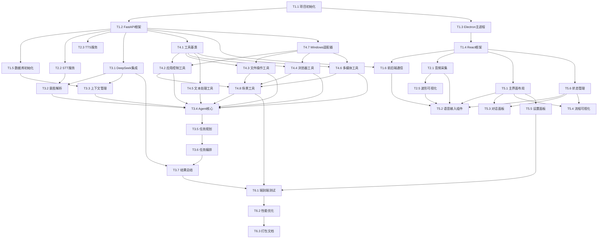

# 原子任务拆解 - VoicePC AI语音控制助手

## 📊 任务拆解概览

基于架构设计,将项目拆解为 **35个原子任务**,分为6个阶段执行。

---

## 🌳 模块树到任务映射

```
VoicePC系统
├── 🔧 Phase 1: 基础设施搭建 (6个任务)
├── 🎤 Phase 2: 语音服务模块 (5个任务)
├── 🤖 Phase 3: AI决策模块 (7个任务)
├── 🛠️ Phase 4: 工具插件模块 (8个任务)
├── 🎨 Phase 5: 前端界面模块 (6个任务)
└── 🚀 Phase 6: 集成测试与优化 (3个任务)
```

---

## 📋 Phase 1: 基础设施搭建

### T1.1 项目初始化与环境配置
**模块路径**: `Root → Infrastructure → Setup`  
**复杂度**: 低  
**预计时间**: 2小时

**输入契约**:
- 空白项目目录
- Windows 10/11 系统
- 互联网连接

**任务描述**:
1. 创建项目目录结构（frontend/ backend/ docs/ tests/）
2. 初始化Node.js项目（Electron + React + TypeScript）
3. 初始化Python项目（FastAPI + 依赖管理）
4. 配置开发工具（ESLint, Prettier, Black）
5. 创建 `.env.example` 环境变量模板
6. 编写 `README.md` 快速开始指南

**输出契约**:
- ✅ 完整的项目目录结构
- ✅ `package.json` 配置完成
- ✅ `requirements.txt` 配置完成
- ✅ 开发环境可正常启动
- ✅ 环境变量模板文件

**验收标准**:
```bash
# 前端可启动
cd frontend && npm install && npm run dev

# 后端可启动
cd backend && pip install -r requirements.txt && python app/main.py
```

**依赖关系**:
- 前置: 无
- 后置: T1.2, T1.3, T1.4, T1.5, T1.6

---

### T1.2 FastAPI后端框架搭建
**模块路径**: `Backend → Framework → FastAPI`  
**复杂度**: 低  
**预计时间**: 2小时

**输入契约**:
- T1.1 完成的Python项目结构
- FastAPI库已安装

**任务描述**:
1. 创建FastAPI应用入口（`app/main.py`）
2. 配置CORS中间件（允许Electron访问）
3. 设置日志系统（`app/utils/logger.py`）
4. 创建配置管理模块（`app/config.py`）
5. 实现健康检查端点（`/health`）
6. 配置WebSocket支持

**输出契约**:
- ✅ FastAPI应用可启动（http://localhost:8000）
- ✅ `/health` 端点返回200
- ✅ WebSocket连接可建立（`/ws`）
- ✅ 日志正常输出到控制台和文件
- ✅ 环境变量正确加载

**验收标准**:
```python
# 测试健康检查
curl http://localhost:8000/health
# 预期输出: {"status": "ok"}

# 测试WebSocket
# 可以成功建立连接
```

**依赖关系**:
- 前置: T1.1
- 后置: T2.1, T3.1, T4.1

---

### T1.3 Electron主进程框架搭建
**模块路径**: `Frontend → Electron → MainProcess`  
**复杂度**: 中  
**预计时间**: 3小时

**输入契约**:
- T1.1 完成的Node.js项目结构
- Electron库已安装

**任务描述**:
1. 创建Electron主进程入口（`src/main/main.ts`）
2. 配置窗口管理（`src/main/window/mainWindow.ts`）
3. 实现IPC通信基础架构（`src/main/ipc/`）
4. 配置开发模式热重载
5. 设置应用图标和托盘
6. 实现preload脚本

**输出契约**:
- ✅ Electron应用可启动并显示窗口
- ✅ 窗口大小、位置、标题正确
- ✅ 开发工具可正常打开
- ✅ IPC通信管道已建立
- ✅ preload脚本注入成功

**验收标准**:
```bash
npm run dev
# 预期: 弹出Electron窗口,显示React欢迎页面
# preload API可在渲染进程中访问
```

**依赖关系**:
- 前置: T1.1
- 后置: T5.1, T5.2

---

### T1.4 React前端框架搭建
**模块路径**: `Frontend → Renderer → ReactApp`  
**复杂度**: 中  
**预计时间**: 3小时

**输入契约**:
- T1.3 完成的Electron渲染进程环境
- React, TypeScript, TailwindCSS已安装

**任务描述**:
1. 创建React应用根组件（`App.tsx`）
2. 配置React Router（用于设置页面等）
3. 配置Zustand状态管理
4. 集成TailwindCSS样式系统
5. 创建基础布局组件（Header, Sidebar, MainContent）
6. 配置TypeScript类型定义

**输出契约**:
- ✅ React应用在Electron中正常渲染
- ✅ TailwindCSS样式生效
- ✅ 路由切换正常
- ✅ 状态管理可用
- ✅ TypeScript类型检查通过

**验收标准**:
```tsx
// 可以正常渲染组件
<App />
  <Header />
  <MainContent>
    <ChatPanel />
  </MainContent>
```

**依赖关系**:
- 前置: T1.3
- 后置: T5.2, T5.3, T5.4

---

### T1.5 数据库初始化
**模块路径**: `Backend → Database → SQLite`  
**复杂度**: 低  
**预计时间**: 2小时

**任务描述**:
1. 创建SQLite数据库连接模块（`app/database/sqlite_db.py`）
2. 设计数据表结构（Session, Message, Task, TaskStep, ToolCall）
3. 实现数据库初始化脚本
4. 创建Repository基类
5. 实现基础CRUD操作

**输出契约**:
- ✅ SQLite数据库文件自动创建
- ✅ 5张数据表结构正确
- ✅ 数据库连接池正常工作
- ✅ 基础CRUD操作可用

**验收标准**:
```python
# 测试数据库操作
from app.database.sqlite_db import Database
db = Database()
session_id = db.create_session()
assert session_id is not None
```

**依赖关系**:
- 前置: T1.2
- 后置: T3.3, T3.4

---

### T1.6 前后端通信集成
**模块路径**: `Communication → WebSocket + HTTP`  
**复杂度**: 中  
**预计时间**: 3小时

**任务描述**:
1. 前端WebSocket客户端（`renderer/services/websocket.ts`）
2. 前端HTTP API客户端（`renderer/services/api.ts`）
3. 后端WebSocket服务端（`app/api/websocket.py`）
4. 消息序列化/反序列化
5. 心跳保活机制
6. 断线重连机制

**输出契约**:
- ✅ WebSocket连接可建立并保持
- ✅ 消息可双向传递
- ✅ HTTP请求响应正常
- ✅ 断线后自动重连
- ✅ 错误处理完善

**验收标准**:
```typescript
// 前端发送消息
websocket.send({type: 'ping'});
// 后端收到并回复
// 前端收到 {type: 'pong'}
```

**依赖关系**:
- 前置: T1.2, T1.4
- 后置: T2.3, T3.5, T5.2

---

## 🎤 Phase 2: 语音服务模块

### T2.1 音频采集模块
**模块路径**: `Frontend → Voice → AudioCapture`  
**复杂度**: 中  
**预计时间**: 3小时

**任务描述**:
1. 请求麦克风权限
2. 实现实时音频流采集（Web Audio API）
3. 音频格式转换（PCM 16kHz）
4. 音频分块处理（512 samples/chunk）
5. 音量检测（VAD: Voice Activity Detection）
6. 录音状态管理

**输出契约**:
- ✅ 麦克风权限正确获取
- ✅ 实时音频流可采集
- ✅ PCM格式正确（16kHz, 16bit, mono）
- ✅ 音频分块大小合理
- ✅ 静音检测生效

**验收标准**:
```typescript
const audioCapture = new AudioCapture();
await audioCapture.start();
// 说话时触发 onAudioData 回调
// 静音时不触发或触发频率降低
```

**依赖关系**:
- 前置: T1.4, T1.6
- 后置: T2.3, T5.2

---

### T2.2 语音识别服务（STT）
**模块路径**: `Backend → Voice → STTService`  
**复杂度**: 中  
**预计时间**: 4小时

**任务描述**:
1. 集成阿里云语音识别SDK
2. 实现实时语音流识别
3. 实现文件语音识别（备用方案）
4. 结果置信度过滤
5. 标点符号自动添加
6. 错误处理与降级（讯飞备用）

**输出契约**:
- ✅ 阿里云API可正常调用
- ✅ 实时流识别延迟 < 2秒
- ✅ 识别准确率 > 85%
- ✅ 返回格式统一（text, confidence）
- ✅ 失败时自动切换备用服务

**验收标准**:
```python
from app.services.voice.stt_service import STTService
stt = STTService()
result = await stt.recognize(audio_data)
assert result.text != ""
assert result.confidence > 0.7
```

**依赖关系**:
- 前置: T1.2
- 后置: T2.3, T3.1

---

### T2.3 语音合成服务（TTS）
**模块路径**: `Backend → Voice → TTSService`  
**复杂度**: 中  
**预计时间**: 3小时

**任务描述**:
1. 集成阿里云语音合成SDK
2. 文本转语音接口
3. 语音参数配置（音色、语速、音量）
4. 音频格式转换
5. 流式返回优化
6. Edge-TTS备用方案

**输出契约**:
- ✅ 阿里云TTS可正常调用
- ✅ 合成延迟 < 1秒
- ✅ 音频质量清晰自然
- ✅ 返回格式: base64编码的WAV/MP3
- ✅ 失败时切换Edge-TTS

**验收标准**:
```python
from app.services.voice.tts_service import TTSService
tts = TTSService()
audio = await tts.synthesize("你好,我是VoicePC助手")
assert len(audio) > 0
# 播放音频可正常听到
```

**依赖关系**:
- 前置: T1.2
- 后置: T5.2, T3.5

---

### T2.4 音频处理器
**模块路径**: `Backend → Voice → AudioProcessor`  
**复杂度**: 低  
**预计时间**: 2小时

**任务描述**:
1. 音频格式验证
2. 采样率转换
3. 降噪处理（可选）
4. 音量归一化
5. base64编解码

**输出契约**:
- ✅ 格式验证准确
- ✅ 格式转换正确
- ✅ 处理后音质不失真

**依赖关系**:
- 前置: T1.2
- 后置: T2.2, T2.3

---

### T2.5 语音波形可视化
**模块路径**: `Frontend → Voice → WaveForm`  
**复杂度**: 中  
**预计时间**: 3小时

**任务描述**:
1. 实时音频波形绘制（Canvas）
2. 频谱分析可视化
3. 音量条显示
4. 动画效果优化
5. 状态指示（录音中、识别中、空闲）

**输出契约**:
- ✅ 波形实时更新流畅
- ✅ 视觉效果美观
- ✅ 性能优化（60fps）

**验收标准**:
```tsx
<WaveForm audioStream={stream} status="recording" />
// 显示实时波形动画
```

**依赖关系**:
- 前置: T1.4, T2.1
- 后置: T5.2

---

## 🤖 Phase 3: AI决策模块

### T3.1 DeepSeek API集成
**模块路径**: `Backend → AI → LLMClient`  
**复杂度**: 低  
**预计时间**: 2小时

**任务描述**:
1. DeepSeek API客户端封装
2. 配置管理（API Key, base_url）
3. 请求参数配置（temperature, max_tokens）
4. 响应解析
5. 错误处理与重试
6. 通义千问备用客户端

**输出契约**:
- ✅ DeepSeek API可正常调用
- ✅ Function Calling支持
- ✅ 流式响应支持（可选）
- ✅ 失败自动切换备用模型

**验收标准**:
```python
from app.services.ai.llm_client import LLMClient
client = LLMClient()
response = await client.chat("你好")
assert response != ""
```

**依赖关系**:
- 前置: T1.2
- 后置: T3.2, T3.4

---

### T3.2 意图解析器
**模块路径**: `Backend → AI → IntentParser`  
**复杂度**: 中  
**预计时间**: 4小时

**任务描述**:
1. 用户输入预处理
2. 意图分类（控制类/查询类/场景类）
3. 实体提取（应用名、文件路径、关键词）
4. 置信度评估
5. 模糊匹配优化
6. 意图Schema定义

**输出契约**:
- ✅ 意图识别准确率 > 90%
- ✅ 实体提取完整
- ✅ 返回结构化意图对象

**验收标准**:
```python
intent = await parser.parse("打开微信")
assert intent.type == "app_control"
assert intent.action == "open"
assert intent.entities["app_name"] == "微信"
```

**依赖关系**:
- 前置: T3.1, T2.2
- 后置: T3.4

---

### T3.3 上下文管理器
**模块路径**: `Backend → AI → ContextManager`  
**复杂度**: 中  
**预计时间**: 4小时

**任务描述**:
1. 会话上下文存储
2. 多轮对话历史管理
3. 实体指代消解（"打开它"、"再来一次"）
4. 上下文窗口管理（防止token溢出）
5. 持久化存储（SQLite）
6. 缓存优化

**输出契约**:
- ✅ 上下文正确保存和加载
- ✅ 指代消解准确
- ✅ 历史记录可查询

**验收标准**:
```python
context.add_message("user", "打开微信")
context.add_message("assistant", "已打开微信")
context.add_message("user", "关闭它")
# 能正确理解"它"指代"微信"
```

**依赖关系**:
- 前置: T1.5, T3.1
- 后置: T3.4

---

### T3.4 LangChain Agent核心
**模块路径**: `Backend → AI → AgentCore`  
**复杂度**: 高  
**预计时间**: 6小时

**任务描述**:
1. 集成LangChain框架
2. 配置ReAct Agent
3. 工具注册与管理
4. Function Calling实现
5. 推理链路记录
6. 结果解释生成

**输出契约**:
- ✅ Agent可正确调用工具
- ✅ 多步骤推理准确
- ✅ 返回执行计划和结果
- ✅ 推理过程可追溯

**验收标准**:
```python
agent = VoicePCAgent()
result = await agent.execute(
    "打开微信并搜索张三",
    context={}
)
assert len(result.steps) == 2
assert result.success == True
```

**依赖关系**:
- 前置: T3.1, T3.2, T3.3
- 后置: T3.5, T4.7

---

### T3.5 任务规划器
**模块路径**: `Backend → AI → TaskPlanner`  
**复杂度**: 高  
**预计时间**: 5小时

**任务描述**:
1. 复杂任务拆解算法
2. 步骤依赖分析
3. 执行顺序优化
4. 并行任务识别
5. 失败回滚策略
6. 执行计划生成

**输出契约**:
- ✅ 任务拆解合理
- ✅ 依赖关系正确
- ✅ 执行计划可行

**验收标准**:
```python
planner = TaskPlanner()
plan = await planner.plan("准备工作")
# 返回: [打开VS Code, 打开浏览器, 播放音乐, 设置音量]
assert len(plan.steps) >= 3
```

**依赖关系**:
- 前置: T3.4
- 后置: T3.6

---

### T3.6 任务编排引擎
**模块路径**: `Backend → Orchestration → Orchestrator`  
**复杂度**: 高  
**预计时间**: 6小时

**任务描述**:
1. 任务队列管理
2. 执行器池调度
3. 步骤状态追踪
4. 结果收集聚合
5. 异常处理与重试
6. 实时进度推送

**输出契约**:
- ✅ 任务按计划执行
- ✅ 执行状态实时更新
- ✅ 失败任务正确处理
- ✅ 最终结果准确

**验收标准**:
```python
orchestrator = Orchestrator()
result = await orchestrator.execute(plan)
assert result.status in ['success', 'partial_success', 'failed']
```

**依赖关系**:
- 前置: T3.5
- 后置: Phase 4所有任务

---

### T3.7 结果总结生成器
**模块路径**: `Backend → AI → ResultSummarizer`  
**复杂度**: 中  
**预计时间**: 3小时

**任务描述**:
1. 执行结果智能总结
2. 成功/失败原因分析
3. 用户友好提示生成
4. 建议生成（失败时）
5. 语音播报文本优化

**输出契约**:
- ✅ 总结简洁清晰
- ✅ 错误提示友好
- ✅ 适合语音播报

**验收标准**:
```python
summary = summarizer.generate(task_result)
# 预期: "已成功打开微信并搜索到张三"
```

**依赖关系**:
- 前置: T3.6, T3.1
- 后置: T5.3

---

## 🛠️ Phase 4: 工具插件模块

### T4.1 工具插件基类
**模块路径**: `Backend → Tools → BaseTool`  
**复杂度**: 低  
**预计时间**: 2小时

**任务描述**:
1. 定义工具基类接口
2. 参数验证机制
3. 结果标准化
4. 异常处理模板
5. Schema生成（LangChain格式）
6. 装饰器支持

**输出契约**:
- ✅ 基类定义完整
- ✅ 其他工具可继承使用
- ✅ Schema格式正确

**验收标准**:
```python
class MyTool(BaseTool):
    async def execute(self, **kwargs):
        return ToolResult(success=True, data="ok")

tool = MyTool()
assert tool.get_schema() is not None
```

**依赖关系**:
- 前置: T1.2
- 后置: T4.2, T4.3, T4.4, T4.5, T4.6

---

### T4.2 应用控制工具
**模块路径**: `Backend → Tools → AppControlTool`  
**复杂度**: 中  
**预计时间**: 4小时

**任务描述**:
1. 应用启动（通过路径/名称）
2. 应用关闭（通过进程/窗口）
3. 窗口聚焦
4. 窗口最小化/最大化
5. 应用路径搜索
6. 常用应用预配置

**输出契约**:
- ✅ 支持启动常见应用（微信、浏览器、VS Code等）
- ✅ 关闭应用不丢失数据
- ✅ 窗口操作准确

**验收标准**:
```python
tool = AppControlTool()
result = await tool.execute(action="open", app_name="微信")
assert result.success == True
# 微信窗口已打开
```

**依赖关系**:
- 前置: T4.1, T4.7
- 后置: T3.4, T4.8

---

### T4.3 文件操作工具
**模块路径**: `Backend → Tools → FileOperationTool`  
**复杂度**: 中  
**预计时间**: 4小时

**任务描述**:
1. 文件打开（默认程序）
2. 文件创建（文本/文件夹）
3. 文件搜索（名称/内容）
4. 文件移动/复制
5. 安全验证（防止删除系统文件）
6. 路径补全

**输出契约**:
- ✅ 文件操作准确
- ✅ 危险操作被阻止
- ✅ 搜索结果准确

**验收标准**:
```python
tool = FileOperationTool()
result = await tool.execute(
    action="create",
    path="D:/test.txt",
    content="Hello"
)
assert os.path.exists("D:/test.txt")
```

**依赖关系**:
- 前置: T4.1, T4.7
- 后置: T3.4, T4.8

---

### T4.4 浏览器控制工具
**模块路径**: `Backend → Tools → BrowserControlTool`  
**复杂度**: 中  
**预计时间**: 3小时

**任务描述**:
1. 浏览器启动（Chrome/Edge）
2. 打开指定URL
3. 搜索引擎查询（百度/Google）
4. 新标签页/关闭标签页
5. URL参数构建

**输出契约**:
- ✅ 浏览器正确打开
- ✅ URL访问准确
- ✅ 搜索功能正常

**验收标准**:
```python
tool = BrowserControlTool()
result = await tool.execute(action="search", query="Python教程")
# 浏览器打开百度搜索结果页
```

**依赖关系**:
- 前置: T4.1, T4.7
- 后置: T3.4, T4.8

---

### T4.5 文本处理工具
**模块路径**: `Backend → Tools → TextProcessingTool`  
**复杂度**: 中  
**预计时间**: 3小时

**任务描述**:
1. 创建文档（txt/md）
2. 写入内容到文档
3. 打开Word/记事本并填充内容
4. 文本格式化
5. AI辅助内容生成（调用LLM）

**输出契约**:
- ✅ 文档创建成功
- ✅ 内容写入正确
- ✅ 格式符合预期

**验收标准**:
```python
tool = TextProcessingTool()
result = await tool.execute(
    action="create_document",
    title="测试文档",
    content="这是内容"
)
# 文档已创建并打开
```

**依赖关系**:
- 前置: T4.1, T4.3
- 后置: T3.4, T4.8

---

### T4.6 多媒体控制工具
**模块路径**: `Backend → Tools → MediaControlTool`  
**复杂度**: 中  
**预计时间**: 4小时

**任务描述**:
1. 音乐播放器控制（打开、播放、暂停）
2. 系统音量控制
3. 视频播放器控制
4. 屏幕截图
5. 媒体键模拟（Play/Pause）

**输出契约**:
- ✅ 音量调节准确
- ✅ 播放控制生效
- ✅ 截图功能正常

**验收标准**:
```python
tool = MediaControlTool()
result = await tool.execute(action="volume", level=50)
# 系统音量调整为50%
```

**依赖关系**:
- 前置: T4.1, T4.7
- 后置: T3.4, T4.8

---

### T4.7 Windows API适配器
**模块路径**: `Backend → Adapters → WindowsAPI`  
**复杂度**: 高  
**预计时间**: 5小时

**任务描述**:
1. pyautogui封装（鼠标键盘操作）
2. pywinauto封装（窗口控制）
3. psutil封装（进程管理）
4. win32api封装（系统API）
5. 权限检查
6. 异常统一处理

**输出契约**:
- ✅ API调用稳定
- ✅ 错误处理完善
- ✅ 跨工具复用

**验收标准**:
```python
api = WindowsAPI()
processes = api.list_processes()
assert len(processes) > 0

window = api.find_window("微信")
api.focus_window(window)
```

**依赖关系**:
- 前置: T1.2
- 后置: T4.2, T4.3, T4.4, T4.6

---

### T4.8 场景管理工具
**模块路径**: `Backend → Tools → SceneManagerTool`  
**复杂度**: 高  
**预计时间**: 5小时

**任务描述**:
1. 场景配置文件设计（JSON）
2. "准备工作"场景实现
3. "创作模式"场景实现
4. 自定义场景加载
5. 场景步骤执行编排
6. 场景参数化

**输出契约**:
- ✅ 2个预设场景可用
- ✅ 场景执行流畅
- ✅ 支持自定义场景

**验收标准**:
```python
tool = SceneManagerTool()
result = await tool.execute(scene_name="准备工作")
# 执行: 打开VS Code → 打开浏览器 → 播放音乐
assert result.success == True
```

**依赖关系**:
- 前置: T4.1, T4.2, T4.3, T4.4, T4.6
- 后置: T3.4

---

## 🎨 Phase 5: 前端界面模块

### T5.1 主界面布局
**模块路径**: `Frontend → UI → MainLayout`  
**复杂度**: 中  
**预计时间**: 3小时

**任务描述**:
1. 响应式布局设计
2. Header导航栏（Logo、状态指示、设置按钮）
3. 侧边栏（历史会话列表）
4. 主内容区（对话面板、流程可视化切换）
5. 主题配置（深色/浅色模式）
6. 窗口控制按钮（最小化、关闭）

**输出契约**:
- ✅ 布局美观现代
- ✅ 响应式适配
- ✅ 主题切换生效

**验收标准**:
```tsx
<MainLayout>
  <Header />
  <Sidebar />
  <MainContent />
</MainLayout>
// 界面正常渲染，无样式错乱
```

**依赖关系**:
- 前置: T1.4
- 后置: T5.2, T5.3, T5.4

---

### T5.2 语音输入组件
**模块路径**: `Frontend → Components → VoiceInput`  
**复杂度**: 中  
**预计时间**: 4小时

**任务描述**:
1. 麦克风按钮（按住说话/点击切换）
2. 实时波形显示（集成T2.5）
3. 状态指示器（空闲、录音、识别中）
4. 识别结果实时展示
5. 键盘快捷键（Space按住）
6. 错误提示UI

**输出契约**:
- ✅ 交互流畅自然
- ✅ 视觉反馈清晰
- ✅ 快捷键生效

**验收标准**:
```tsx
<VoiceInput 
  onRecognized={(text) => console.log(text)}
/>
// 按住说话，松开识别，显示结果
```

**依赖关系**:
- 前置: T2.1, T2.5, T1.6
- 后置: T5.3

---

### T5.3 对话面板组件
**模块路径**: `Frontend → Components → ChatPanel`  
**复杂度**: 中  
**预计时间**: 4小时

**任务描述**:
1. 消息列表展示（用户/AI/系统）
2. 消息类型渲染（文本、执行结果、错误）
3. Markdown渲染支持
4. 自动滚动到底部
5. 加载动画（AI思考中）
6. 消息时间戳

**输出契约**:
- ✅ 消息展示清晰
- ✅ 自动滚动流畅
- ✅ Markdown正确渲染

**验收标准**:
```tsx
<ChatPanel messages={messages} />
// 消息按时间顺序展示
// 不同类型消息样式不同
```

**依赖关系**:
- 前置: T1.4, T5.1
- 后置: 无

---

### T5.4 执行流程可视化组件
**模块路径**: `Frontend → Components → FlowVisualization`  
**复杂度**: 高  
**预计时间**: 6小时

**任务描述**:
1. 任务流程图绘制（基于React Flow/Canvas）
2. 任务节点展示（名称、状态、图标）
3. 连线和箭头
4. 实时状态更新动画
5. 节点点击查看详情
6. 执行进度条

**输出契约**:
- ✅ 流程图清晰易读
- ✅ 状态更新实时
- ✅ 动画流畅美观

**验收标准**:
```tsx
<FlowVisualization 
  steps={taskSteps}
  currentStep={3}
/>
// 显示DAG流程图
// 当前执行步骤高亮
```

**依赖关系**:
- 前置: T1.4, T5.1
- 后置: 无

---

### T5.5 设置面板组件
**模块路径**: `Frontend → Components → SettingsPanel`  
**复杂度**: 中  
**预计时间**: 3小时

**任务描述**:
1. API密钥配置（DeepSeek、阿里云）
2. 语音参数配置（音色、语速）
3. 快捷键配置
4. 安全选项配置
5. 应用信息展示
6. 配置导入/导出

**输出契约**:
- ✅ 配置项完整
- ✅ 保存生效
- ✅ 验证提示友好

**验收标准**:
```tsx
<SettingsPanel />
// 输入API Key → 点击保存 → 配置生效
```

**依赖关系**:
- 前置: T1.4, T5.1
- 后置: 无

---

### T5.6 状态管理集成
**模块路径**: `Frontend → Store → StateManagement`  
**复杂度**: 中  
**预计时间**: 3小时

**任务描述**:
1. 应用全局状态（连接状态、用户配置）
2. 对话状态（消息列表、当前会话）
3. 任务执行状态（执行中的任务、流程图数据）
4. 状态持久化（LocalStorage）
5. 状态同步（WebSocket消息 → 状态更新）

**输出契约**:
- ✅ 状态管理清晰
- ✅ 组件状态同步
- ✅ 持久化生效

**验收标准**:
```typescript
const { messages, addMessage } = useChatStore();
addMessage({ role: 'user', content: 'test' });
// 所有订阅组件自动更新
```

**依赖关系**:
- 前置: T1.4
- 后置: T5.2, T5.3, T5.4

---

## 🚀 Phase 6: 集成测试与优化

### T6.1 端到端功能测试
**模块路径**: `Testing → E2E → FunctionalTest`  
**复杂度**: 中  
**预计时间**: 4小时

**任务描述**:
1. 语音识别端到端测试
2. 5个基础工具测试用例
3. 2个复杂场景测试
4. 错误场景测试
5. 安全机制测试
6. 测试报告生成

**输出契约**:
- ✅ 所有核心功能可用
- ✅ 测试覆盖率 > 80%
- ✅ 关键路径无bug

**验收标准**:
```bash
pytest tests/e2e/ -v
# 所有测试用例通过
```

**依赖关系**:
- 前置: Phase 1-5所有任务
- 后置: T6.2

---

### T6.2 性能优化与调试
**模块路径**: `Optimization → Performance`  
**复杂度**: 中  
**预计时间**: 4小时

**任务描述**:
1. 前端性能分析（Lighthouse）
2. 后端响应时间优化
3. WebSocket消息压缩
4. 内存泄漏检查
5. 启动速度优化
6. 日志级别调整

**输出契约**:
- ✅ 语音识别延迟 < 2秒
- ✅ AI响应时间 < 5秒
- ✅ 内存占用 < 500MB
- ✅ 界面操作流畅

**验收标准**:
```bash
# 性能指标达标
启动时间 < 5秒
语音识别延迟 < 2秒
任务执行无明显卡顿
```

**依赖关系**:
- 前置: T6.1
- 后置: T6.3

---

### T6.3 打包与文档完善
**模块路径**: `Delivery → Package`  
**复杂度**: 中  
**预计时间**: 4小时

**任务描述**:
1. Electron应用打包（Windows .exe）
2. 依赖检查脚本
3. 一键启动脚本
4. README.md完善
5. 用户使用手册
6. 演示视频录制

**输出契约**:
- ✅ 可执行安装包
- ✅ 文档完整清晰
- ✅ 演示视频专业

**验收标准**:
```bash
# 双击voicepc-setup.exe
# 安装后可正常运行
```

**依赖关系**:
- 前置: T6.2
- 后置: 无（项目完成）

---

## 📊 任务依赖图



---

## 📅 5天执行计划

### Day 1 (10月21日) - 今天
**目标**: 完成基础设施 + 语音服务
- ✅ T1.1 项目初始化 (2h)
- ✅ T1.2 FastAPI框架 (2h)
- ✅ T1.3 Electron主进程 (3h)
- ⏳ T1.4 React框架 (3h)
- ⏳ 晚上: T1.5 数据库 + T1.6 通信 (5h)
**进度**: 6/35 任务

### Day 2 (10月22日)
**目标**: 完成语音+AI基础
- T2.1 音频采集 (3h)
- T2.2 STT服务 (4h)
- T2.3 TTS服务 (3h)
- T2.4 音频处理 (2h)
- T3.1 DeepSeek集成 (2h)
- T3.2 意图解析 (4h)
**进度**: 12/35 任务

### Day 3 (10月23日)
**目标**: 完成AI核心+工具基础
- T3.3 上下文管理 (4h)
- T3.4 Agent核心 (6h)
- T4.1 工具基类 (2h)
- T4.7 Windows适配器 (5h)
- T4.2 应用控制工具 (开始)
**进度**: 17/35 任务

### Day 4 (10月24日)
**目标**: 完成所有工具+任务编排
- T4.2 应用控制工具 (完成, 4h)
- T4.3 文件操作工具 (4h)
- T4.4 浏览器工具 (3h)
- T4.5 文本处理工具 (3h)
- T4.6 多媒体工具 (4h)
- T3.5 任务规划 (5h)
**进度**: 23/35 任务

### Day 5 (10月25日)
**目标**: 完成前端+场景+测试
- T3.6 任务编排 (6h)
- T3.7 结果总结 (3h)
- T4.8 场景工具 (5h)
- T5.1 主界面布局 (3h)
- T5.2 语音输入组件 (开始)
**进度**: 27/35 任务

### Day 6 (10月26日上午)
**目标**: 完成前端+集成测试+打包
- T5.2 语音输入组件 (完成, 4h)
- T2.5 波形可视化 (3h)
- T5.3 对话面板 (4h)
- T5.4 流程可视化 (快速版, 4h)
- T5.5 设置面板 (2h)
- T5.6 状态管理 (3h)
- T6.1 功能测试 (4h)
- T6.2 性能优化 (4h)
- T6.3 打包文档 (4h)
**进度**: 35/35 任务 ✅

---

## 🎯 关键里程碑

- ✅ Day 1结束: 基础框架可运行
- ✅ Day 2结束: 语音识别可用
- ✅ Day 3结束: AI可理解并规划任务
- ✅ Day 4结束: 所有基础工具可用
- ✅ Day 5结束: 复杂场景可演示
- ✅ Day 6中午: 完整产品交付

---

## ⚠️ 风险与应对

### 高风险任务
1. **T3.4 Agent核心** (6h) - AI能力核心
   - 风险: LangChain集成复杂
   - 应对: 提前准备示例代码,降级为简单规则引擎
   
2. **T5.4 流程可视化** (6h) - 技术难度高
   - 风险: 图形渲染性能问题
   - 应对: 降级为简单列表展示

3. **T4.7 Windows适配器** (5h) - 系统兼容性
   - 风险: 权限问题、API兼容性
   - 应对: 充分测试,准备多个备用方案

### 时间压缩策略
如果时间不足,优先级排序:
- **P0 (必须)**: T1.x, T2.2, T2.3, T3.1, T3.4, T4.2, T4.3, T4.8, T5.1-T5.3, T6.3
- **P1 (重要)**: T3.5, T3.6, T4.4, T5.4, T6.1
- **P2 (加分)**: T2.5, T3.7, T5.5, T6.2

---

## ✅ 原子化完成确认

- ✅ 所有架构模块已映射为原子任务
- ✅ 每个任务符合原子化标准（2-8小时）
- ✅ 依赖关系清晰无循环
- ✅ 任务数量适配项目复杂度（35个任务）
- ✅ 5天时间分配合理

---

**原子化完成时间**: 2025-10-21  
**下一步**: 进入审批阶段（APPROVE）  
**准备执行**: 等待用户确认后立即开始实施

---

